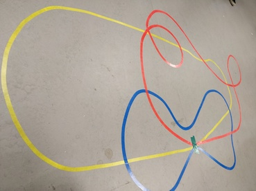

.. slide:: middleSlide

Objectifs
=========

.. slide::

Challenges
----------

1) Suivi de ligne
~~~~~~~~~~~~~~~~~

* Le robot doit être capable de **suivre une ligne de couleur**
* Lorsqu'il arrive au bout du parcours, identifié par un marqueur, il passe au
  **parcours suivant**, dans l'ordre:
  * Jaune
  * Bleu
  * Rouge

.. slide::

2) Go To
~~~~~~~~~

Le robot est posé sur une position initiale (par exemple une croix au sol),
et nous donnons une position/orientation cible $$x, y, \theta$$.

Le robot doit rouler pour atteindre cette position/orientation.

.. slide::

3) Odométrie
~~~~~~~~~~~~

Le robot est déplacé au sol (en mode "roues libres").

Après un certain temps, vous indiquerez où le robot se situe par rapport à
la position initiale ($$x, y, \theta$$)

.. slide::

4) Dessin de la carte
~~~~~~~~~~~~~~~~~~~~~

Après avoir suivi la ligne du challenge 1, le robot produira une carte (une image)
du/des parcours "vu de haut".

.. slide::

Guide
-----

.. |rarr| raw::

    &rarr;

Voici des fonctions que nous vous recommandons d'implémenter, pour la partie odométrie:

* $$direct\_kinematics(v_{gauche}, v_{droit})$$ |rarr| $$(\dot x, \dot \theta)$$
  * Prend en paramètre la vitesse des deux roues (par exemple en *rad/s*)
  et retourne la vitesse linéaire (*m/s*) et angulaire (*rad/s*) du robot

* $$odom(\dot x, \dot \theta, dt)$$ |rarr| $$(dx, dy, d\theta)$$
  * Prend en paramètre la vitesse linéaire et angulaire, et retourne la variation
  de position (en *m*) et la variation angulaire (en *rad*) dans le **repère du robot**

* $$tick\_odom(x_{n-1}, y_{n-1}, \theta_{n-1})$$ |rarr| $$(x_n, y_n, \theta_n)$$
  * Prend en paramètre la position/orientation du robot, la variation de position et d'orientation,
  et retourne la nouvelle position/orientation du robot dans le **repère du monde**

Pour le contrôle:

* $$forward\_kinematics(\dot x, \dot y)$$ |rarr| $$(v_{gauche}, v_{droit})$$
  * Prend en paramètre la vitesse linéaire et angulaire souhaitée, et calcule la vitesse de la
  roue gauche et droite
* $$go\_to\_xya(x, y, \theta)$$
  * Amène le robot à une position cible dans le **repère monde**
* $$pixel\_to\_robot(x, y)$$ |rarr| $$x, y, z$$
  * Prend en paramètre la position d'un pixel dans l'image, et calcule la position du pixel dans
  le **repère du robot**
* $$pixel\_to\_world(x, y)$$ |rarr| $$x, y, z$$
  * Pareil, mais dans le **repère monde**

.. note::

    Vous pourrez vous réferer au `cours de robotique d'ASPIC <https://gregwar.com/ASPIC/>`_

